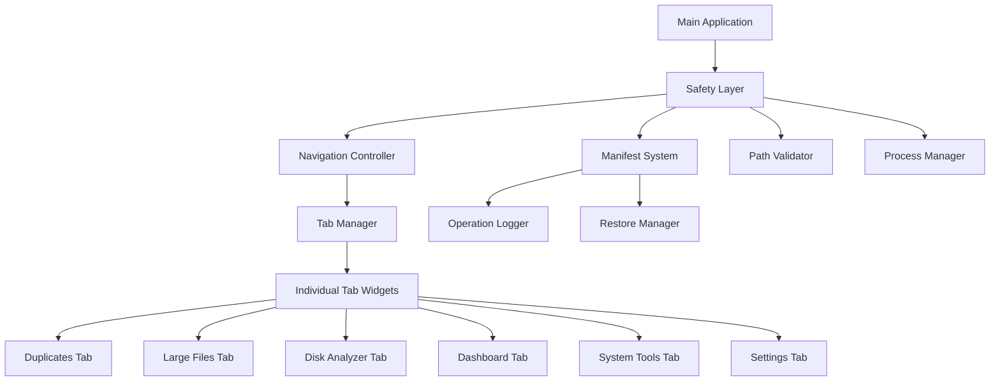

# Design Document

## Overview

This design document outlines the transformation of the Deep Cleaner application from a monolithic GUI structure to a modular, secure, and maintainable architecture. The design addresses both the immediate need to refactor the 3,000-line main_window.py and the critical safety requirements for a file cleaning application.

The solution implements a modern navigation-based interface with strict safety protocols, comprehensive error handling, and a robust undo system that ensures user trust and data protection.

## Architecture

### High-Level Architecture



### Core Components

1. **Safety Layer**: Central security and validation system
2. **Navigation Controller**: Modern side-panel navigation system
3. **Tab Manager**: Manages individual feature modules
4. **Manifest System**: Operation tracking and undo functionality
5. **Individual Tab Widgets**: Modular, self-contained feature implementations

## Components and Interfaces

### 1. Safety Layer (`src/deep_cleaner/gui/safety/`)

#### SafetyManager

```python
class SafetyManager:
    def __init__(self, config: Config, logger: Logger):
        self.path_validator = PathValidator()
        self.manifest_system = ManifestSystem()
        self.process_manager = ProcessManager()

    def validate_operation(self, operation: Operation) -> ValidationResult:
        """Validates any destructive operation before execution"""

    def execute_safe_operation(self, operation: Operation, dry_run: bool = True) -> OperationResult:
        """Executes operations with full safety protocols"""
```

#### PathValidator

```python
class PathValidator:
    def is_safe_to_delete(self, path: Path) -> bool:
        """Validates path against system blacklists and user whitelists"""

    def check_symlink_safety(self, path: Path) -> bool:
        """Prevents symlink-based attacks"""

    def validate_user_permissions(self, path: Path) -> bool:
        """Ensures user has appropriate permissions"""
```

#### ManifestSystem

```python
class ManifestSystem:
    def create_operation_manifest(self, operation: Operation) -> str:
        """Creates atomic manifest with unique operation ID"""

    def log_file_action(self, action: FileAction) -> None:
        """Logs individual file operations"""

    def get_restore_operations(self, manifest_id: str) -> List[RestoreAction]:
        """Generates restore actions from manifest"""
```

### 2. Navigation System (`src/deep_cleaner/gui/navigation/`)

#### NavigationController

```python
class NavigationController(QWidget):
    def __init__(self, parent=None):
        self.nav_list = QListWidget()
        self.main_stack = QStackedWidget()
        self.setup_navigation()

    def setup_navigation(self):
        """Creates side navigation with icons and labels"""

    def add_tab(self, widget: QWidget, name: str, icon: QIcon):
        """Adds a new tab to both navigation and stack"""

    def switch_to_tab(self, index: int):
        """Handles tab switching with proper cleanup"""
```

### 3. Base Tab Interface (`src/deep_cleaner/gui/tabs/base_tab.py`)

#### BaseTab

```python
class BaseTab(QWidget):
    operation_requested = Signal(Operation)
    status_changed = Signal(str)

    def __init__(self, config: Config, logger: Logger, safety_manager: SafetyManager):
        self.config = config
        self.logger = logger
        self.safety_manager = safety_manager
        self.setup_ui()

    def setup_ui(self):
        """Abstract method for UI setup"""
        raise NotImplementedError

    def request_operation(self, operation: Operation):
        """Requests operation through safety layer"""
        self.operation_requested.emit(operation)

    def update_translations(self):
        """Updates UI text for internationalization"""
        pass
```

### 4. Individual Tab Implementations

#### DashboardTab (`src/deep_cleaner/gui/tabs/dashboard_tab.py`)

- Welcome screen with system overview
- Smart Scan button with progress tracking
- Recent operations summary
- Quick access to common features

#### DuplicatesTab (`src/deep_cleaner/gui/tabs/duplicates_tab.py`)

- Migrated from main_window.py
- Integrated with safety layer
- Preview mode with detailed file information
- Batch selection with safety confirmations

#### LargeFilesTab (`src/deep_cleaner/gui/tabs/large_files_tab.py`)

- Size-based file analysis
- Interactive size threshold controls
- Safe deletion with manifest tracking
- Visual size representations

#### DiskAnalyzerTab (`src/deep_cleaner/gui/tabs/disk_analyzer_tab.py`)

- Embedded visualization using QWebEngineView
- Treemap and sunburst charts within application
- Interactive drill-down capabilities
- Export functionality for reports

### 5. Smart Scan System (`src/deep_cleaner/gui/smart_scan/`)

#### SmartScanWorker

```python
class SmartScanWorker(QThread):
    progress_updated = Signal(int, str)
    scan_completed = Signal(dict)

    def __init__(self, safety_manager: SafetyManager):
        self.safety_manager = safety_manager
        self.scan_modules = [
            TempFileCleaner(),
            EmptyFileCleaner(),
            CacheCleaner(),
            DuplicateFinder()
        ]

    def run(self):
        """Executes safe scanning operations sequentially"""
```

## Data Models

### Operation Model

```python
@dataclass
class Operation:
    id: str
    type: OperationType
    paths: List[Path]
    parameters: Dict[str, Any]
    dry_run: bool = True
    user_confirmed: bool = False
    timestamp: datetime
```

### Manifest Schema

```python
{
    "op_id": "20251022T193100_7a3f2c",
    "timestamp": "2025-10-22T19:31:00+05:30",
    "user": {
        "uid": 1000,
        "username": "user"
    },
    "os": "Windows 10",
    "operation": "clean",
    "options": {
        "dry_run": false,
        "ruleset": "default"
    },
    "items": [
        {
            "id": "1",
            "type": "file",
            "original_path": "C:\\Users\\user\\AppData\\Local\\Temp\\abc.tmp",
            "action": "moved_to_trash",
            "trash_path": "C:\\Users\\user\\.deep_cleaner\\trash\\op_20251022\\abc.tmp",
            "size": 12488,
            "sha256": "ab12...ef",
            "status": "ok"
        }
    ],
    "summary": {
        "files_processed": 10,
        "dirs_processed": 2,
        "errors_count": 0
    }
}
```

## Error Handling

### Layered Error Handling Strategy

1. **Input Validation**: Validate all user inputs and file paths
2. **Permission Checks**: Verify user permissions before operations
3. **Safety Validation**: Check against blacklists and safety rules
4. **Operation Monitoring**: Track all file operations with rollback capability
5. **User Feedback**: Provide clear, actionable error messages

### Error Recovery Patterns

```python
class ErrorHandler:
    def handle_operation_error(self, error: Exception, operation: Operation) -> ErrorResponse:
        """Handles errors with appropriate recovery strategies"""

    def create_error_report(self, error: Exception, context: Dict) -> ErrorReport:
        """Creates detailed error reports for debugging"""

    def suggest_recovery_actions(self, error: Exception) -> List[RecoveryAction]:
        """Provides user-friendly recovery suggestions"""
```

## Testing Strategy

### Unit Testing Approach

1. **Safety Layer Tests**

   - Path validation with various edge cases
   - Manifest creation and atomicity
   - Process execution safety

2. **GUI Component Tests**

   - Tab initialization and cleanup
   - Navigation functionality
   - Signal/slot connections

3. **Integration Tests**
   - End-to-end operation flows
   - Safety layer integration
   - Manifest system reliability

### Test Structure

```
tests/
├── unit/
│   ├── test_safety_manager.py
│   ├── test_path_validator.py
│   ├── test_manifest_system.py
│   └── test_tab_components.py
├── integration/
│   ├── test_operation_flow.py
│   ├── test_smart_scan.py
│   └── test_restore_functionality.py
└── fixtures/
    ├── test_files/
    └── mock_configs/
```

### Safety Testing Protocols

1. **Isolated Test Environment**: All tests run in temporary directories
2. **No Real File Deletion**: Use mock trash directories
3. **Permission Testing**: Test with various permission scenarios
4. **Symlink Attack Prevention**: Test symlink traversal protection
5. **Manifest Integrity**: Verify manifest atomicity and consistency

## Security Considerations

### Process Execution Safety

```python
class ProcessManager:
    def execute_safe_command(self, cmd: List[str], timeout: int = 30) -> ProcessResult:
        """Safely executes external commands with validation"""
        if not shutil.which(cmd[0]):
            raise ExecutableNotFoundError(cmd[0])

        try:
            result = subprocess.run(
                cmd,
                capture_output=True,
                text=True,
                timeout=timeout,
                check=False  # Handle return codes manually
            )
            return ProcessResult(result.returncode, result.stdout, result.stderr)
        except subprocess.TimeoutExpired:
            raise ProcessTimeoutError(cmd, timeout)
```

### Path Traversal Prevention

- Resolve all paths to absolute paths
- Validate against known safe/unsafe directory patterns
- Check for symlink attacks and directory traversal attempts
- Implement OS-specific safety rules

### Privilege Management

- Check for required privileges before system operations
- Provide clear elevation prompts when needed
- Restrict operations based on current privilege level
- Log all privilege-related decisions

## Implementation Phases

### Phase 1: Safety Infrastructure

1. Implement SafetyManager and core safety components
2. Create PathValidator with comprehensive rules
3. Build ManifestSystem with atomic operations
4. Establish ProcessManager for safe external calls

### Phase 2: Navigation Framework

1. Create NavigationController with modern UI
2. Implement BaseTab interface
3. Build tab registration and management system
4. Create Dashboard as landing page

### Phase 3: Tab Migration

1. Migrate DuplicatesTab with safety integration
2. Migrate LargeFilesTab with new architecture
3. Migrate DiskAnalyzerTab with embedded visualizations
4. Integrate existing temp_cleaner_tab and empty_files_tab

### Phase 4: Smart Scan Implementation

1. Create SmartScanWorker with safety protocols
2. Implement progress tracking and user feedback
3. Build result summary and action interfaces
4. Add batch operation capabilities

### Phase 5: Polish and Integration

1. Implement internationalization system
2. Add comprehensive error handling
3. Create embedded visualization system
4. Finalize testing and documentation
