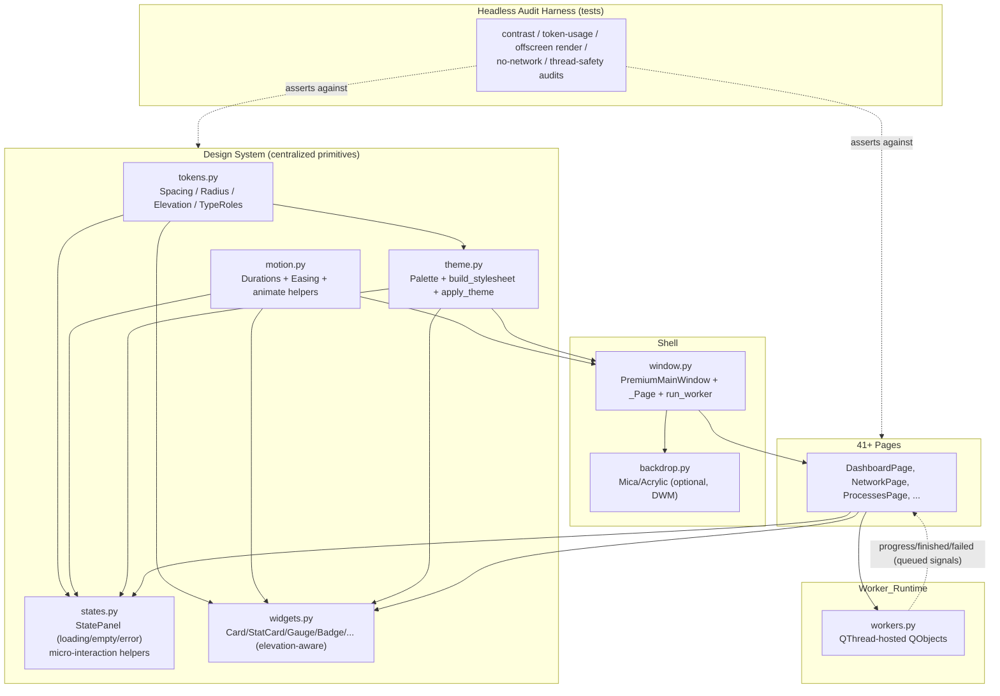

# Design Document

## Overview

This feature is a cross-cutting quality pass that turns the existing Cortex Cleaner UI into a modern, 2027-grade premium experience where every scroll, click, hover, and state transition feels smooth, consistent, and honest. It does not add screens; it hardens and unifies the *design system* that all 41+ pages already share.

The work is organized around one idea: **make "premium" a set of enforced, centralized primitives** — tokens, motion, elevation/glass, control states, and loading/empty/error states — that every page consumes, plus a **headless audit harness** that proves the primitives are actually used and that the app never blocks the UI thread or goes online.

The design deliberately builds on what exists rather than rewriting:

- A single `Palette` token set in `theme.py` with a QSS builder (`build_stylesheet`) and `apply_theme`.
- Reusable widgets in `widgets.py` (`Card`, `StatCard`, `CircularGauge`, `Badge`, `CoreBars`, `TrafficGraph`, `attach_glow`, `icon_for_exe`).
- A `_Page` base (`window.py`) that wraps content in a `QScrollArea`, plus a `run_worker` QThread helper and per-page lazy `_autoload`.

New capability is added as **three small, dependency-light modules** — `tokens.py` (extended design tokens), `motion.py` (motion system), and `states.py` (loading/empty/error panels + micro-interaction helpers) — wired into `theme.py` and consumed by pages through helpers, so adoption is incremental and auditable.

### Goals

- Centralize spacing, radius, elevation, typography roles, and motion into tokens (Req 3, 4, 12).
- Add an elevation scale and a token-driven "glass" surface treatment with an optional Windows 11 Mica/Acrylic backdrop that gracefully degrades (Req 12).
- Provide reusable loading/empty/error state panels and adopt them on data-backed pages (Req 7).
- Guarantee non-blocking, cancellable, honest interaction and progress (Req 1, 2).
- Enforce control states, scroll behavior, responsive layout, live detail, and accessibility (Req 5, 6, 8, 9, 10).
- Keep everything fully offline and assertable under Qt `offscreen` (Req 11).

### Non-Goals

- No new tools/pages or engine features.
- No third-party UI/theming/animation libraries (keeps the app light and offline).
- No promise of subjective "feel" as an automated assertion — human review remains the final judge; tests enforce the *mechanisms* that produce the feel.

## Architecture



### Layering and dependency rules

- `tokens.py` depends on nothing (pure data + helpers). It defines the ordered `Elevation` scale, `Spacing` (8pt base), `Radius`, and `TypeRole` mappings so they can be asserted without Qt.
- `motion.py` depends only on `PySide6.QtCore` (durations/easing + a couple of `QPropertyAnimation` factory helpers). All animation timings live here.
- `theme.py` imports `tokens.py` to build QSS from tokens (no more scattered literals). `Palette` gains elevation/glass/gradient token fields.
- `states.py` imports `tokens`, `motion`, and `theme` to render `StatePanel` and to attach micro-interactions.
- `widgets.py` and pages consume the above. No page defines its own colors/durations.
- `backdrop.py` is isolated and platform-guarded; failure never propagates.

## Components and Interfaces

### 1. Extended design tokens — `tokens.py` (Req 3, 4, 12)

Pure-Python, Qt-free, so headless tests assert against them directly.

```python
# Spacing — single 8pt base scale (Req 3.4)
class Spacing:
    BASE = 8
    XXS, XS, SM, MD, LG, XL, XXL = 2, 4, 8, 12, 16, 24, 32

# Corner radius scale (Req 3.5)
class Radius:
    SM, MD, LG, PILL = 8, 12, 18, 999

# Typography roles: name -> (px_size, weight, letter_spacing) (Req 3.3)
TYPE_ROLES = {
    "page_title":    (25, 800, 0.3),
    "section_title": (15, 800, 0.4),
    "metric":        (27, 800, 0.5),
    "body":          (14, 400, 0.0),
    "caption":       (11, 700, 1.6),
}

# Elevation scale: ordered levels (Req 12.1, 12.2)
class Elevation(IntEnum):
    BACKGROUND = 0   # app/window backdrop
    SURFACE    = 1   # base cards/panels
    RAISED     = 2   # hero, popovers, hovered rows
    OVERLAY     = 3  # modals, menus, tooltips

# Per-level treatment resolved from the active Palette
def elevation_style(p: "Palette", level: Elevation) -> ElevationStyle:
    """Return (surface_color, border_color, shadow_blur, shadow_alpha, surface_alpha)
    for the given level so higher levels are visibly 'closer'."""
```

`ElevationStyle` is a small frozen dataclass. The mapping guarantees monotonic depth cues (higher level ⇒ lighter/blurrier/stronger border), which Req 12.2 asserts.

### 2. Palette + QSS builder updates — `theme.py` (Req 3, 6, 12)

`Palette` gains token fields (all with sensible defaults so both `MIDNIGHT`/`DAYLIGHT` stay valid):

```python
@dataclass(frozen=True)
class Palette:
    ...                      # existing fields kept
    # elevation surfaces (Req 12.1)
    surface_raised: str      # RAISED level fill
    overlay: str             # OVERLAY level fill (modals/menus)
    # glass (Req 12.3)
    glass_alpha: int         # 0-255 surface translucency for glass treatments
    glass_border: str        # subtle top-edge highlight border
    # gradients (Req 12.6)
    accent_grad_stops: tuple[tuple[float, str], ...]
    @property
    def accent_gradient(self) -> str: ...        # kept
    def glass(self, level) -> str: ...           # rgba() surface for a level
```

`build_stylesheet(p)` is refactored to source every spacing/radius/color from `tokens` + `Palette` (Req 3.1, 3.2). Key additions to QSS:

- **Elevation-aware cards**: `QFrame#Card` = SURFACE, `QFrame#HeroCard`/`#Glass` = RAISED with glass fill + `glass_border` top highlight.
- **Complete control states** for every interactive type (Req 6.5): `:hover`, `:pressed`, `:focus`, `:disabled` for `QPushButton` (+ `#Primary/#Ghost/#Danger`), `QPushButton#NavItem`, `QLineEdit/QComboBox/QSpinBox`, `QCheckBox`, and item-views (`QTreeView/QTableView/QListWidget` rows + indicators).
- **Focus ring** (Req 6.3, 10): a distinct `:focus` outline/border using `accent` that differs from hover — added to buttons, nav items, inputs, and item views.
- **Scrollbars** styled from tokens (Req 5.3), thin, transparent track, rounded handle.

`apply_theme` remains the single entry point that restyles the whole app from one `Palette` (Req 3.6), still using `Fusion` + full stylesheet so no widget is left on prior colors.

### 3. Motion system — `motion.py` (Req 4, 12.5)

```python
class Duration:            # milliseconds (Req 4.1)
    INSTANT = 90           # micro-interaction feedback (<120ms, Req 12.5)
    FAST    = 160
    NORMAL  = 220          # page fade-in (150-300ms, Req 4.2)
    SLOW    = 320          # metric/gauge one-shot (Req 4.4)

EASING_STANDARD = QEasingCurve.Type.OutCubic   # shared easing (Req 4.1)
EASING_EMPHASIS = QEasingCurve.Type.InOutCubic

def fade_in(widget, duration=Duration.NORMAL, on_done=None) -> QPropertyAnimation:
    """Opacity 0->1 via a QGraphicsOpacityEffect that is REMOVED on finish
    (Req 4.3) so drop-shadows on child cards are never suppressed."""

def animate_property(target, prop: bytes, start, end,
                     duration=Duration.SLOW, easing=EASING_STANDARD): ...
```

Rules encoded here:
- One appearance animation per page transition; `window._fade_in` is reimplemented on top of `motion.fade_in` and keeps a single `_page_anim` reference (Req 4.6).
- Effects are torn down on `finished` (Req 4.3).
- Live/recurring metric refreshes call setters directly (no per-tick animation) while one-shot results use `animate_property` (Req 4.4, 4.5). `StatCard._pulse` and `CircularGauge.animate_to` are retargeted to `motion` timings.

### 4. State panels + micro-interactions — `states.py` (Req 7, 12.5)

A single reusable widget covers loading/empty/error so every data-backed page behaves identically:

```python
class StatePanel(QWidget):
    """Overlay/inline panel with three modes; token-styled, offscreen-safe."""
    def show_loading(self, text: str = "Working…") -> None: ...   # Req 7.1
    def show_empty(self, text: str) -> None: ...                  # Req 7.2
    def show_error(self, message: str) -> None: ...               # Req 7.3 (human-readable)
    def clear(self) -> None: ...                                  # Req 7.4 (reveal results)
    def mode(self) -> str: ...   # "loading"|"empty"|"error"|"hidden"  (test hook, Req 11.4)
```

- Loading uses an indeterminate spinner/`QProgressBar` (Req 2.4) unless a determinate count is provided.
- Error mode shows the worker's `failed` message verbatim and exposes a retry affordance; it never fabricates success (Req 7.5).
- `mode()` is the assertable state hook for headless tests (Req 11.4).

Micro-interaction helpers (Req 12.5) live here too and are applied centrally:

```python
def install_hover_lift(widget, dy=1, duration=Duration.INSTANT): ...   # subtle raise on hover
def focus_ring(widget) -> None: ...   # ensure a visible focus indicator (complements QSS)
```

Micro-interactions are primarily QSS-driven (`:hover/:pressed/:focus`) so they are free and offscreen-safe; the helpers add optional geometry/opacity nuance for hero CTAs and cards only, keeping animation count low.

### 5. Scroll behavior policy — `_Page` + pages (Req 5)

The existing `_Page` scroll-area pattern is formalized into a documented contract:

- `_Page` provides the outer `QScrollArea` (`widgetResizable=True`). Card-heavy pages let the outer area scroll (Req 5.1).
- List/tree/table-dominant pages give the list a stretch factor and a *small* `minimumHeight`, so the page fits the viewport and only the inner list scrolls — no whole-page jump (Req 5.2). This is exactly the Dashboard fix already applied (tree `minimumHeight(140)`), now stated as policy and applied consistently.
- Nested scroll conflict (Req 5.5): inner list/tree views set a wheel policy so a wheel gesture targets a single scroll container; when an inner view is not at a scroll boundary it consumes the wheel, otherwise the outer area scrolls. Implemented via a small reusable `SingleScrollFilter` event filter attached by `_Page` to inner scrollables.
- Scrollbar hidden when content fits (Req 5.4): scroll areas use `ScrollBarAsNeeded`.
- Scrollbars styled from tokens (Req 5.3) via QSS.

### 6. Optional native backdrop — `backdrop.py` (Req 12.4)

```python
def apply_backdrop(win) -> str:
    """Best-effort Windows 11 Mica/Acrylic via DwmSetWindowAttribute
    (DWMWA_SYSTEMBACKDROP_TYPE / DWMWA_USE_IMMERSIVE_DARK_MODE using ctypes).
    Returns the applied mode name, or 'opaque' if unsupported/failed.
    NEVER raises; on any failure the app keeps its opaque token background."""
```

- Purely additive, `ctypes`-based (no new dependency), guarded by OS/build checks.
- When active, the glass surfaces read against the composited backdrop; when `opaque` is returned, glass surfaces fall back to solid token fills (still layered by elevation), so functionality and contrast are unaffected (Req 12.4, 12.8).
- Called once from `PremiumMainWindow.__init__` after the frameless flags are set.

### 7. Live detail presentation — `widgets.icon_for_exe` + pages (Req 8)

`icon_for_exe` already caches native icons by path via `QFileIconProvider`. This is formalized:

- List rows for executables/apps use `icon_for_exe` for the real icon and the item's real name (Req 8.1), with a token-styled placeholder glyph when the icon is null (Req 8.3).
- Cache is keyed by source path so live 1s refreshes never re-fetch (Req 8.2) — already true; a test locks it in.
- Names/icons/descriptions come only from local system calls; no network (Req 8.4, 11.2).

### 8. Accessibility helpers (Req 10)

- **Keyboard reachability** (Req 10.1, 10.2): all primary actions are `QPushButton`/nav buttons that are natively focusable and Tab-ordered by insertion; `focusPolicy` is verified non-`NoFocus` for primary actions. A `set_tab_order(parent, widgets)` helper enforces predictable order where insertion order differs from visual order.
- **Focus indicator** (Req 6.3): QSS `:focus` rules; verified present for each interactive type.
- **Contrast** (Req 10.3, 10.4): a pure `contrast_ratio(fg, hex)` function (WCAG relative luminance) lives in `tokens.py`; a test asserts `text/bg`, `text/surface`, `text/surface_raised`, `on_accent/accent` meet 4.5:1, and large-text/essential pairs meet 3:1, for both themes. If a current token fails, the token value is nudged as part of this feature.
- **Non-color signaling** (Req 10.5): `Badge` already pairs color with text ("SAFE"/"REVIEW"/"CAUTION"); policy extended to any semantic-colored status.
- **Modal focus** (Req 10.6): `QMessageBox`/dialogs are modal and Qt returns focus to the trigger; a helper `run_modal(dialog, trigger)` centralizes focus-return where custom prompts are used.

### 9. Interaction responsiveness & honest progress (Req 1, 2)

No architectural change to the proven `run_worker` model — it is documented as the contract and audited:

- Every long operation is a `QObject` worker moved to a `QThread`; callbacks are bound methods of main-thread objects so Qt uses queued connections (Req 1.1, 1.3, 1.4).
- Activation gives immediate feedback (button disable + `StatePanel.show_loading`) within the response budget (Req 1.2).
- First-view data loads via `_autoload` on the worker runtime (Req 1.5).
- Cancellation: workers expose `cancel()` + `threading.Event`; pages show an enabled Cancel control while running and return to idle on cancel (Req 2.1, 2.2). Dashboard scan already does this; the pattern is extended to all cancellable workers.
- Progress text/value is only ever set from worker `progress` signals; determinate bars use real work-unit counts, otherwise indeterminate (Req 2.3, 2.4, 2.5).

## Data Models

```python
@dataclass(frozen=True)
class ElevationStyle:
    surface: str        # hex or rgba string
    border: str
    shadow_blur: int
    shadow_alpha: int   # 0-255
    surface_alpha: int  # 0-255 (255 = opaque; < 255 = glass)

@dataclass(frozen=True)
class MotionSpec:
    duration_ms: int
    easing: QEasingCurve.Type
```

No persisted data, no schema changes. Tokens are compile-time constants; the only runtime "state" is `StatePanel.mode()` and the active theme name (already handled by `PremiumMainWindow.set_theme`).

## Correctness Properties

These are the invariants the implementation must uphold; they drive property-based and example-based tests (Req 11.4 makes them assertable headlessly).

### Property 1: Elevation monotonicity
For any `Palette` and levels `a < b`, `elevation_style(p, b)` is a strictly stronger depth cue than `a` (surface no darker, and border-strength or shadow strictly greater).

**Validates: Requirements 12.1, 12.2**

### Property 2: Contrast floor
For both themes, every defined body-text/background token pair has `contrast_ratio ≥ 4.5`, and every large-text/essential-UI pair has `≥ 3.0`.

**Validates: Requirements 10.3, 10.4, 12.8**

### Property 3: Motion bounds
Every appearance duration ∈ [150, 300] ms; every micro-interaction feedback duration ≤ 120 ms; all animations reference a `motion` easing constant.

**Validates: Requirements 4.1, 4.2, 12.5**

### Property 4: Effect teardown
After any `fade_in`/pulse animation `finished`, the target widget's `graphicsEffect()` is `None`.

**Validates: Requirements 4.3**

### Property 5: Token sourcing
`build_stylesheet(p)` contains no color literal that is not derived from `p`/tokens (audited by scanning the generated QSS against the palette's values).

**Validates: Requirements 3.1, 3.2**

### Property 6: State exclusivity
`StatePanel.mode()` is exactly one of loading/empty/error/hidden; `show_*` transitions are mutually exclusive and `clear()` ⇒ hidden.

**Validates: Requirements 7.1, 7.2, 7.3, 7.4**

### Property 7: Offscreen renderability
Every registered page constructs and renders under `QT_QPA_PLATFORM=offscreen` without exception.

**Validates: Requirements 11.3**

### Property 8: No-network
Exercising the polish code paths opens no socket (asserted by monkeypatching `socket.socket`/`socket.create_connection` to fail in tests).

**Validates: Requirements 11.1, 11.2**

### Property 9: Thread safety of feedback
Worker terminal signals (`finished`/`failed`) are connected to main-thread bound-method slots (queued), never invoked directly from the worker thread.

**Validates: Requirements 1.1, 1.3**

### Property 10: Backdrop degradation
`apply_backdrop` returns a valid mode string and never raises, on any platform.

**Validates: Requirements 12.4**

### Property 11: Icon cache stability
Repeated `icon_for_exe(path)` returns the same cached object and performs at most one provider lookup per path.

**Validates: Requirements 8.2**

### Property 12: Single-scroll
For a page with a fixed hero and a scrollable list, a wheel event delivered to the inner list does not change the outer scroll area's value while the inner list can still scroll.

**Validates: Requirements 5.2, 5.5**

## Error Handling

The polish layer is decorative and infrastructural; its failures must never degrade core functionality. The strategy is "fail soft, never fake."

- **Optional visual enhancements fail silently.** `apply_backdrop` (Mica/Acrylic), `attach_glow`, `fade_in`, and micro-interaction helpers are wrapped so any exception is swallowed and logged at debug level; the widget simply renders without the effect (Req 12.4). This mirrors the existing `attach_glow`/`_fade_in` guards.
- **Backdrop unavailability** returns the string `"opaque"` and the app uses solid token surfaces; no user-visible error (Property 10).
- **Worker failures** surface through the existing `failed` signal into `StatePanel.show_error(message)` with the real, human-readable message, and the page returns to an interactive idle state. No fabricated success is shown (Req 7.3, 7.5). Unhandled worker exceptions are already funneled to `failed` by each worker's `try/except`.
- **Missing icons/descriptions**: `icon_for_exe` returns `None` on any failure and the row renders a token placeholder glyph (Req 8.3); the icon cache still records the `None` so lookups aren't retried.
- **Theme application**: `apply_theme` is defensive — if `_HAS_QT` is false or `app` is `None` it returns the `Palette` without styling, so token logic remains testable without a running app.
- **Animation teardown on interruption**: if a page is destroyed mid-animation, the `finished`-connected teardown is a no-op guarded against a deleted target; effects are parented to their target so Qt cleans them up.
- **Contrast token failures are build-time, not runtime**: if a token pair fails the contrast property, the failing test blocks the change and the token is corrected — users never see a low-contrast state ship.

## Testing Strategy

All tests run headless under `QT_QPA_PLATFORM=offscreen` with `PYTHONPATH=src`, matching the existing suite; the benign offscreen teardown exit code and font warning are ignored as today.

### Unit / property tests (pure, no Qt)
- `tokens.py`: elevation monotonicity (Property 1), contrast floors for both themes (Property 2, via `hypothesis` over the defined token pairs and fixed assertions), spacing/radius/type-role presence (Req 3.3–3.5).
- `motion.py`: duration bounds and easing-constant usage (Property 3).

### Widget / integration tests (Qt offscreen)
- `StatePanel`: mode exclusivity and transitions (Property 6).
- `fade_in`/`StatCard._pulse`/`CircularGauge.animate_to`: effect is removed after `finished` (Property 4) — driven by flushing the event loop / `QTest.qWait`.
- Theme application: `apply_theme("dark"/"light")` restyles without error; generated QSS token-sourcing audit (Property 5).
- Page construction: parametrized over all `_NAV` page ids — each constructs and renders offscreen (Property 7). Extends the existing `test_premium_gui.py` smoke tests.
- Control states: generated QSS contains `:hover`, `:pressed`, `:focus`, `:disabled` selectors for each interactive type (Req 6.5).
- Single-scroll behavior on a hero+list page (Property 12).
- Icon cache stability (Property 11).

### Guardrail tests
- No-network: monkeypatch sockets, exercise theme apply + page construction + a mock worker cycle; assert zero connection attempts (Property 8).
- Thread-safety: assert worker terminal signals are wired to main-thread slots (Property 9); assert no filesystem/subprocess call is made from the UI thread in page constructors (audit that constructors don't call engine walk/delete directly).
- Backdrop degradation on the CI (non-Windows/headless) returns `opaque` without raising (Property 10).

### Manual verification (documented, not automated)
- The subjective "premium feel" — smoothness of real scrolling, glass/Mica appearance on Windows 11, and micro-interaction crispness — is confirmed by running `run_gui.py` on the target machine. The automated suite guarantees the mechanisms; the human confirms the result.

## Design Decisions and Rationale

- **Extend, don't rewrite.** The app already has a single-`Palette` system and a working worker model. Adding `tokens.py`/`motion.py`/`states.py` and refactoring `build_stylesheet` to consume tokens gives centralization and enforceability without destabilizing 41+ pages. Incremental adoption keeps each change testable.
- **Glass via tokens, Mica as enhancement.** True backdrop blur behind app content is not something Qt widgets do portably. Rather than fake it or hard-depend on platform APIs, glass is a token-defined translucent surface + subtle top-highlight border + elevation shadow, with Windows 11 Mica/Acrylic applied via `ctypes`/DWM as a *progressive enhancement* that always degrades to an opaque, still-layered look. This matches current practice (dark glassmorphism with elevation depth cues) while staying honest about limits.
- **QSS-first micro-interactions.** Hover/press/focus are expressed in QSS so they cost nothing at runtime, work under `offscreen`, and are auditable by scanning the stylesheet. Geometry/opacity nuances are reserved for a few hero elements to keep the concurrent-animation count low (Req 4.6).
- **No fake progress, ever.** Indeterminate operations show an indeterminate indicator; determinate ones use real counts from workers. This is a trust requirement, consistent with the product's "honesty is the moat" principle.
- **Assertable "feel".** Because perceived smoothness can't be unit-tested, the design exposes the *mechanisms* (token values, motion specs, state modes, thread wiring, no-network) as headless-assertable surfaces, so the premium quality attributes don't silently regress over time.
- **No new runtime dependencies.** Everything uses PySide6 + stdlib (`ctypes` for Mica). Keeps the build light, the app offline, and packaging (PyInstaller) unchanged.

## Requirements Coverage Map

| Requirement | Design element(s) |
|---|---|
| 1. Non-blocking responsiveness | §9 (run_worker contract, autoload, immediate feedback), Property 7, 9 |
| 2. Cancellable & honest progress | §9 (cancel events, progress-signal-only), StatePanel indeterminate mode |
| 3. Consistent tokens | §1 tokens, §2 QSS-from-tokens, Property 5 |
| 4. Consistent motion | §3 motion.py, Property 3, 4 |
| 5. Premium scroll | §5 scroll policy + SingleScrollFilter, Property 12 |
| 6. Control states | §2 QSS states + focus ring, §8 focus |
| 7. Loading/empty/error | §4 StatePanel, Property 6 |
| 8. Live detail | §7 icon_for_exe + placeholders, Property 11 |
| 9. Responsive layout | §5 + existing `resizeEvent` margin mapping, frameless snap/resize |
| 10. Accessibility | §8 helpers, contrast (Property 2), focus, non-color signaling, modal focus |
| 11. Offline & testable | §Testing, Property 7, 8; `mode()`/tokens/motion exposed |
| 12. Modern visual language | §1 elevation, §2 glass/gradients, §3 micro-interaction timing, §6 backdrop, Property 1, 10 |
