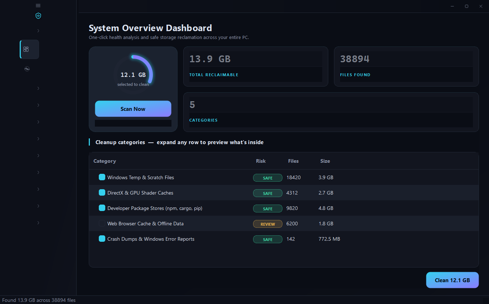
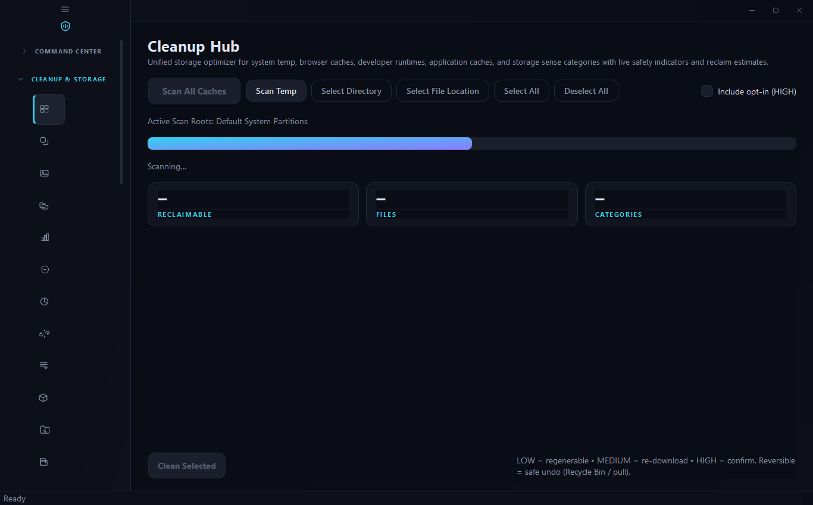
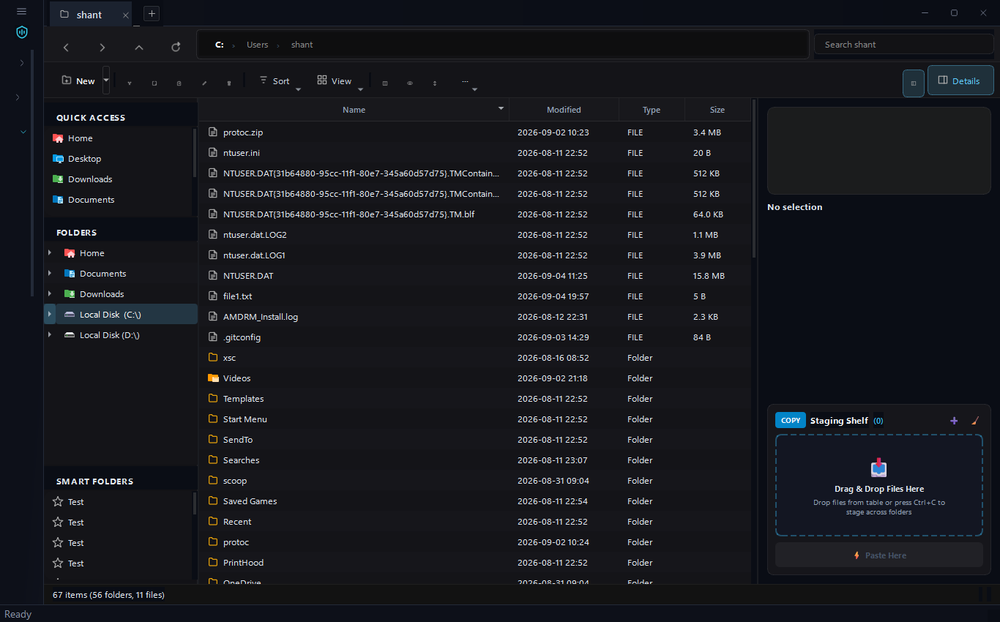
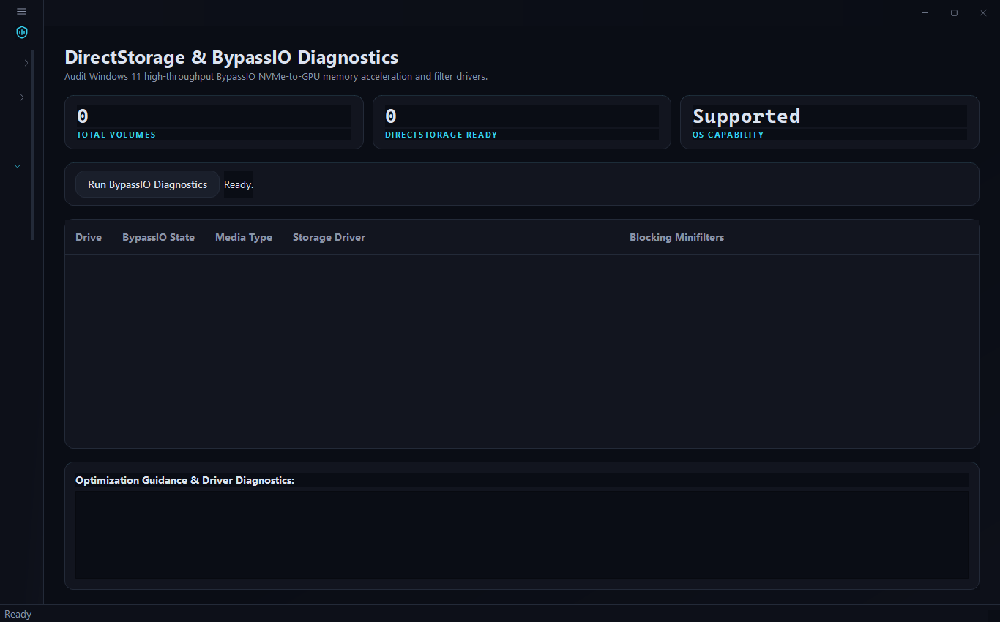
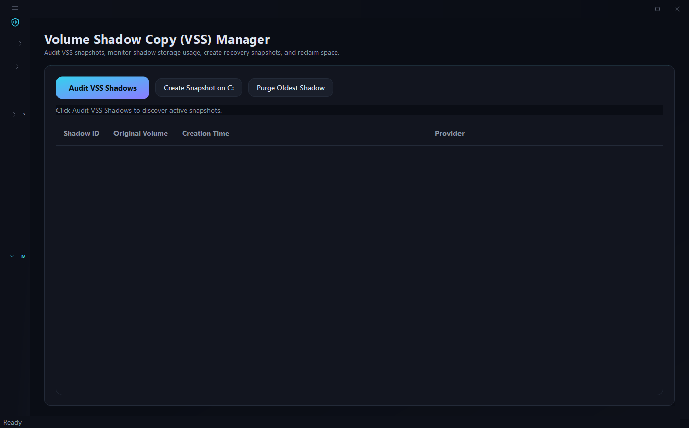
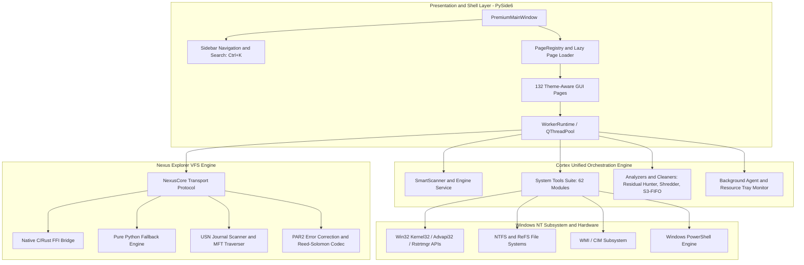

<div align="center">
  <h1>🛡️ Cortex Workstation</h1>
  <p><strong>The Ultimate Windows NT Systems, Forensics & File Management Platform</strong></p>
  <p>
    <a href="https://github.com/Destroyer-official/Cortex-Workstation"></a>
    <a href="https://www.python.org/"></a>
    <a href="https://www.microsoft.com/windows"></a>
    <a href="LICENSE"></a>
    <a href="docs/FEATURE_DIRECTORY.md"></a>
    <a href="ONE_BY_ONE_VERIFICATION_REPORT.md"></a>
    <a href="tests/"></a>
    <a href="tests/"></a>
    <a href="docs/"></a>
  </p>
</div>

<br>

**Cortex Workstation** is an enterprise-grade Windows operating system workstation, forensic storage analyzer, and dual-pane virtual file manager. Designed for systems administrators, forensic investigators, power users, and developers, Cortex Workstation provides direct, low-level control over Windows NT internals, NTFS/ReFS filesystems, kernel memory management, and process security tokens.

Combining the **Cortex Unified Optimization Engine** with the high-performance **Nexus Explorer VFS Subsystem**, Cortex Workstation delivers a responsive, non-destructive, and military-grade toolkit that eliminates system rot, reclaims gigabytes of locked storage, and protects data integrity.

---

## 📑 Table of Contents

- [Key Capabilities & Feature Highlights](#-key-capabilities--feature-highlights)
- [Live UI Demo & Visual Tour](#-live-ui-demo--visual-tour)
- [System Architecture](#-system-architecture)
- [Interactive Navigation & UI Pages](#-interactive-navigation--ui-pages)
- [Quickstart & Installation](#-quickstart--installation)
- [Command Line Interface (CLI)](#-command-line-interface-cli)
- [Verification & Quality Assurance](#-verification--quality-assurance)
- [Documentation Index](#-documentation-index)
- [Contributing](#-contributing)
- [Security & Safe Execution Policy](#-security--safe-execution-policy)
- [License](#-license)

---

## ⚡ Key Capabilities & Feature Highlights

### 🛡️ Enterprise Security & Forensics
- **Process Security Token Forensics**: Decodes Win32 process tokens, TokenIntegrityLevels (Untrusted, Low, Medium, High, System), TokenElevationTypes, and detects dangerous elevated privileges including SeDebugPrivilege and SeImpersonatePrivilege.
- **Windows BAM/DAM & SRUM Execution Forensics**: Audits kernel Background Activity Moderator (BAM) timestamps, Desktop Activity Moderator (DAM) traces, and inspects SRUDB.dat execution metrics with selective sanitization.
- **NTFS MFT Record Slack & Directory Index Sanitizer**: Audits 1024-byte file record segments and $INDEX_ALLOCATION buffers for orphaned resident file fragments, sanitizing slack space safely.
- **BitLocker & Drive Encryption Auditor**: Audits volume encryption status, cipher strength (XTS-AES 128/256), and active TPM/PIN Key Protectors via manage-bde and WMI.
- **SMB Share & Network Exposure Auditor**: Audits active Windows shares, flags exposed administrative shares (C$, ADMIN$, IPC$), checks SMB signing, and alerts on deprecated SMBv1 protocols (EternalBlue vector).
- **Silent BitRot & Integrity Scrubber**: Maintains a persistent SQLite cryptographic baseline (SHA-256) to detect silent bit flips, physical storage degradation, and unauthorized file tampering.
- **Forensic Checksum Matrix**: Multithreaded parallel calculation of CRC32, MD5, SHA-1, SHA-256, and SHA-512 with batch manifest generation and directory verification across .sha256, .sfv, and .md5 formats.
- **Windows Restart Manager File Unlocker**: Uses native Win32 rstrtmgr.dll APIs to identify and release processes holding exclusive locks without crashing system services.

### 🚀 Hardware & System Performance Tuning
- **DirectStorage & BypassIO Hardware Acceleration Auditor**: Queries Windows 11 BypassIO state, validates NVMe-to-GPU DirectStorage paths, and flags blocking storage minifilters (antivirus, legacy filters).
- **RAM Standby List & Working Set Kernel Purger**: Invokes native NtSetSystemInformation (Class 80) to purge standby memory pages, empty process working sets, and flush modified pages directly to disk.
- **Windows Search Index (Windows.edb) Optimizer**: Stops WSearch and performs offline ESENT B-tree defragmentation (esentutl.exe /d) or clean background catalog resets.
- **SSD NVMe TRIM & Wear-Leveling Optimizer**: Queries physical flash media types, inspects NTFS/ReFS DisableDeleteNotify, and triggers live volume block deallocation (Optimize-Volume -ReTrim).
- **ReFS Dev Drive & CoW Optimizer**: Detects Windows 11 Resilient File System (ReFS) Dev Drives, verifies instant Copy-on-Write (CoW) block cloning (FSCTL_DUPLICATE_EXTENTS_TO_FILE), and inspects Defender Performance Mode.
- **Windows Memory Compression (MMAgent)**: Measures real-time RAM compressed store size, working sets, and page combining savings. Allows toggling memory compression for low-latency competitive gaming or audio workstations.
- **Virtual Memory & Pagefile Hardware Tuner**: Audits physical RAM commit limits, peak paging loads, and multi-disk pagefile placement across high-speed NVMe drives.
- **Windows Service Manager**: Analyzes background services and provides 1-click scenario-based tuning profiles (Minimal, Workstation, Gamer, Enterprise Safe).

### 🧹 Deep Forensic Cleaning & Space Reclamation
- **Winapp2.ini Community Application Cleaner**: Declarative deep cleaning engine supporting over 500+ desktop applications, browsers, game launchers, and IDEs with dynamic path variable resolution.
- **GPU & DirectX Shader Cache Cleaner**: Deep cleans orphaned compiled shader binaries across DirectX D3DSCache, NVIDIA DXCache/GLCache, AMD DxCache, and Intel GPU caches.
- **Windows 11 AI & Recall Telemetry Cleaner**: Scans Copilot offline caches, Recall semantic stores, and checkpoints/truncates inflated SQLite WAL databases.
- **Developer Package Stores Cleaner**: Reclaims gigabytes of cached installer packages and build artifacts across Windows winget, Rust cargo, C++ vcpkg, and .NET nuget.
- **Volume Shadow Copy (VSS) Manager & Health Analyzer**: Audits shadow copy snapshots, flags stalled VSS writers, and provides 1-click state reset.
- **Virtual Environment & Sandbox Purger**: Reclaims storage locked in Windows Sandbox containers, Hyper-V saved states (.vsv, .bin), checkpoint differencing disks (.avhdx), and WSL2 scratch containers.

### 📁 Nexus Explorer Dual-Pane VFS File Manager
- **High-Throughput VFS Transport**: Dual-pane file management interface supporting tabs, split views, and asynchronous thread-pool transfer queues.
- **Native C/Rust FFI Bridge**: Hardware-accelerated transport bridge with seamless pure Python fallbacks.
- **NTFS USN Change Journal Indexer**: Queries FSCTL_READ_USN_JOURNAL for sub-second file indexing across millions of files without recursive directory walking.
- **PAR2 Reed-Solomon Error Correction**: Creates packet-based parity volumes for mission-critical archives, verifying cryptographic blocks and repairing corrupted sectors.

---

## 🖥️ Live UI Demo & Visual Tour

Experience the look, feel, and performance of Cortex Workstation:

<div align="center">
  
  <p><em>Figure 1: Cortex Command Center in Live Simulation Mode with Circular Hero Gauge, Engine Telemetry & SAFE / REVIEW Risk Profiling.</em></p>
</div>

<br>

<div align="center">
  <table width="100%">
    <tr>
      <td width="50%" align="center">
        <br>
        <strong>🧹 One-Click Deep Cleanup Hub</strong><br>
        <em>Winapp2.ini deep cleaning, shader caches, dev package purger</em>
      </td>
      <td width="50%" align="center">
        <br>
        <strong>📁 Nexus Dual-Pane VFS Explorer</strong><br>
        <em>Instant USN Journal indexer, PAR2 parity codec, tabbed queues</em>
      </td>
    </tr>
    <tr>
      <td width="50%" align="center">
        <br>
        <strong>⚡ DirectStorage & BypassIO Auditor</strong><br>
        <em>Validate NVMe-to-GPU paths and storage minifilter drivers</em>
      </td>
      <td width="50%" align="center">
        <br>
        <strong>🛡️ VSS Shadow Copy & Snapshot Manager</strong><br>
        <em>Volume shadow auditing, snapshot creation, and writer health resets</em>
      </td>
    </tr>
  </table>
</div>

### 🎮 Safe Interactive Simulation / Demo Mode

Curious to explore Cortex Workstation before performing real system modifications? Cortex includes a built-in **Simulation & Demo Mode** that populates realistic mock scan telemetry, safe system metrics, and non-destructive dry-run cleaning:

```powershell
# Launch the full PySide6 GUI in safe simulation/demo mode:
python run_gui.py --demo
# or
python run_gui.py --simulation

# Run CLI interactive simulation demo:
python -m cortex_unified.cli.cli demo
```

---

## 🏗️ System Architecture



For comprehensive technical specifications on threading, Win32 interop, and design tokens, see [`docs/ARCHITECTURE.md`](docs/ARCHITECTURE.md).

---

## 🖥️ Interactive Navigation & UI Pages

Cortex Workstation features **132 interactive GUI pages** organized into **10 intuitive sections**:

| Section ID | Section Title | Page Count | Primary Features |
| :--- | :--- | :--- | :--- |
| `overview` | **Command Center** | 2 | System Overview Dashboard, PC Health Check |
| `cleanup` | **Cleanup & Storage** | 32 | One-Click Cleanup Hub, Extended Third-Party App Caches, Shader Caches, Dev Packages |
| `files` | **Files & Explorer** | 21 | Nexus File Explorer, Process Restart Manager Unlocker, Checksum Matrix, USN Journal |
| `system` | **System Performance** | 29 | DirectStorage BypassIO, Kernel Standby Purger, SSD NVMe TRIM, Dev Drive CoW |
| `activity` | **Privacy & Activity** | 9 | BAM/SRUM Execution Forensics, AI Features & Recall Sanitizer, Privacy Shield |
| `network` | **Network & Defense** | 10 | SMB Share Auditor, DNS Benchmark, Firewall Manager, Traffic Monitor |
| `apps` | **Apps & Security** | 14 | Deep Software Uninstaller, Outdated Driver Store Cleaner, Context Menu Manager |
| `security` | **Security Tools** | 5 | Process Tokens, BitLocker Encryption Status, BitRot Scrubber, Secure Shredder |
| `recovery` | **Recovery & Reports** | 5 | Volume Shadow Copies (VSS), Restore Points, Audit Reports, System Recovery |
| `maintenance`| **Maintenance & Repair** | 5 | VSS Writer Health, Windows Update Cleaner, Update Repair, Deep Disk Space Scanner |

*Full catalog and factory class mapping available in [`docs/FEATURE_DIRECTORY.md`](docs/FEATURE_DIRECTORY.md).*

---

## 🚀 Quickstart & Installation

### 📦 Windows Standalone Executables & Architecture Support

For non-technical users, Cortex Workstation is distributed as pre-compiled standalone packages that require **no Python or Rust installation**:

| Architecture / Distribution | Format | Support Status | Download & Execution Method |
| :--- | :--- | :--- | :--- |
| **Windows 10/11 x64 Setup Installer**<br>*(Recommended)* | `.exe` | ✅ **Fully Supported** | Download [**`Cortex-Workstation-v1.2.0-Setup.exe`**](https://github.com/Destroyer-official/Cortex-Workstation/releases/download/v1.2.0/Cortex-Workstation-v1.2.0-Setup.exe) (388 MB) from [**GitHub Release v1.2.0**](https://github.com/Destroyer-official/Cortex-Workstation/releases/tag/v1.2.0). 1-click installer with desktop & Start Menu shortcuts and clean uninstaller. |
| **Windows 10/11 x64 Standalone Portable** | `.zip` | ✅ **Fully Supported** | Download [**`Cortex-Workstation-v1.2.0-Windows-x64.zip`**](https://github.com/Destroyer-official/Cortex-Workstation/releases/download/v1.2.0/Cortex-Workstation-v1.2.0-Windows-x64.zip) (380 MB). Extract anywhere and run `CortexCleaner.exe`. Zero installation required. |
| **Windows 11 ARM64**<br>*(Snapdragon X Elite / Copilot+ PCs)* | `.exe` / `.zip` | ✅ **Natively Supported** | Natively supported via Windows 11 Microsoft Prism x64 emulation. Runs seamlessly with zero setup. |
| **Windows 32-bit (x86)** | — | ❌ **Not Supported** | PySide6 / Qt 6 officially dropped 32-bit Windows support upstream in Qt 6.0; Windows 11 itself strictly requires a 64-bit architecture. |

---

### 💻 Developer & Source Code Setup

#### Prerequisites
- **Operating System**: Windows 10 (Build 19041+) or Windows 11 (64-bit).
- **Python**: Version 3.10 through 3.14 (64-bit).

```powershell
# 1. Clone the repository
git clone https://github.com/Destroyer-official/Cortex-Workstation.git
cd Cortex-Workstation

# 2. Create and activate virtual environment
python -m venv .venv
.venv\Scripts\Activate.ps1

# 3. Install dependencies and editable package
pip install --upgrade pip setuptools wheel
pip install -r requirements.txt
pip install -r requirements-dev.txt
pip install -e .

# 4. Launch the Interactive GUI
python run_gui.py
```

---

## 💻 Command Line Interface (CLI)

Cortex Workstation provides a comprehensive command-line interface for automation and administrative scripts:

```powershell
# Display help and available commands
cortex --help
# or
python -m cortex_unified.cli.cli --help

# Run a quick system diagnostic scan
python -m cortex_unified.cli.cli scan

# Clean temporary files with dry-run preview
python -m cortex_unified.cli.cli clean --dry-run

# Run interactive simulation demo (safe sandbox mode)
python -m cortex_unified.cli.cli demo

# Run full production readiness verification
python -m cortex_unified.debug.runner
```

---

## 🧪 Verification & Quality Assurance

Every program file, tool, and page in the repository is backed by automated tests and strict validation:

| Test / Diagnostic Suite | Target Scope | Passed | Failures | Pass Rate |
| :--- | :--- | :--- | :--- | :--- |
| **Complete Unit Test Suite** (`pytest`) | Backend tools, VFS, hashing, and OS modules | **1569 / 1569** | **0** | **100%** |
| **Page Registry & Factory Verification** | All 132 page factories dynamically resolve | **132 / 132** | **0** | **100%** |
| **Vector SVG Icon Pipeline** | Crisp vector assets (no glyphs, no duplicates) | **132 / 132** | **0** | **100%** |
| **One-by-One Program File Audit** | AST syntax, compilation, and package imports | **484 / 484** | **0** | **100%** |
| **Docstring Coverage** | Public defs across `src + tests + scripts` | **9287 / 9287** | **0** | **100%** |

```powershell
# Run the complete test suite
pytest tests/ -v --no-cov

# Run one-by-one compilation and import audit
python scripts/check_all_structure_files.py
```

---

## 🌌 Documentation Hub & Multi-Tiered Architecture

Cortex Workstation features a multi-tiered, three-column documentation hub designed to serve everyday users, system administrators, and core contributors alike:

| Documentation Tier | Target Audience | Focus Areas | Documentation Path |
| :--- | :--- | :--- | :--- |
| **🌎 Welcome Hub** | Everyone | Project vision, core capabilities, quick-start, and global map | **[`docs/index.md`](docs/index.md)** |
| **📦 User Space** | End-Users & Integrators | Getting started, step-by-step recipes, configuration reference, and troubleshooting | **[`docs/user/`](docs/user/getting-started.md)** |
| **🏗️ Developer Platform** | Contributors & Core Team | Repository architecture map, thread safety, testing pipelines, and PR reviews | **[`docs/dev/`](docs/dev/architecture.md)** |
| **🔌 API & Subsystems** | Systems Engineers | Lifecycle tables, 62 system tools reference, 23 analyzers, and core engine caches | **[`docs/api/`](docs/api/overview.md)** |

> [!TIP]
> **Online Interactive Documentation**: The complete documentation hub featuring a responsive 3-column layout, tree-structured sidebar, on-page scroll-spy, and real-time instant search is deployed to GitHub Pages at [**https://destroyer-official.github.io/Cortex-Workstation/**](https://destroyer-official.github.io/Cortex-Workstation/).

### Documentation Directory Quick Links
- 🚀 **[Getting Started & Installation](docs/user/getting-started.md)**: Setup, virtual environments, and prerequisites.
- 🛠️ **[Step-by-Step How-To Guides](docs/user/how-to-guides.md)**: Real-world operational recipes.
- 🎛️ **[Configuration Reference](docs/user/configuration.md)**: YAML/JSON schema, CLI flags, and environment variables.
- 🗂️ **[Nexus File Manager Guide](docs/user/nexus-explorer.md)**: USN Journal, PAR2 recovery, and undo/redo workflows.
- 🗺️ **[Repository Architecture Map](docs/dev/architecture.md)**: Technical breakdown of modules and subsystems.
- 🛡️ **[State Management & Thread Safety](docs/dev/threading-safety.md)**: PathGuard security boundaries and worker models.
- 🧪 **[Testing & CI/CD Pipelines](docs/dev/testing.md)**: Local test validation and production diagnostics.
- 🔌 **[Core API & Subsystem Specifications](docs/api/overview.md)**: In-depth lifecycle functions and interfaces.

---

## 🤝 Contributing

We welcome contributions from the open-source community! Whether you are implementing new system tools, refining UI animations, or reporting bugs, please read our [`CONTRIBUTING.md`](CONTRIBUTING.md) guide and adhere to our coding standards.

---

## 🔒 Security & Safe Execution Policy

Cortex Workstation is built on the principle of **non-destructive operation by default**:
- Scan passes are strictly read-only.
- Destructive actions (permanent file deletion, registry purging, service reconfiguration) require explicit user confirmation.
- Directory junctions and symlinks are unlinked safely without touching target directory contents.
- Least privilege execution ensures the application functions smoothly under standard user privileges, prompting for UAC elevation only when interacting with kernel-level components.

For vulnerability reporting procedures, see [`SECURITY.md`](SECURITY.md).

---

## 📄 License

Cortex Workstation is distributed under the open-source **MIT License**. See [`LICENSE`](LICENSE) for complete terms.