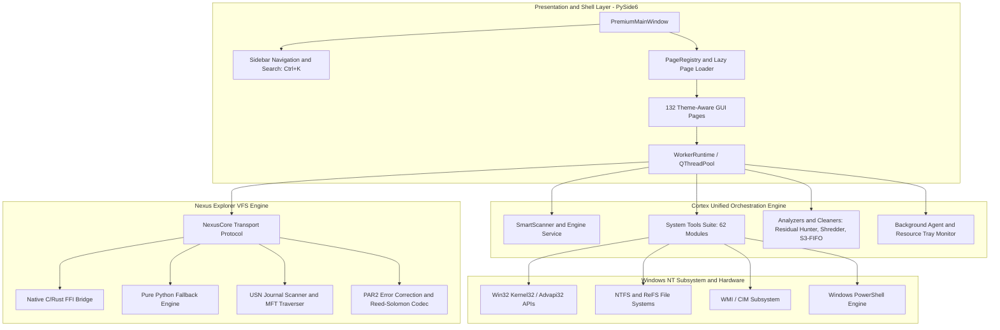

# Cortex Workstation — Technical Architecture Specification

This document provides a comprehensive technical overview of the Cortex Workstation & Nexus Explorer architecture for engineers, systems programmers, and open-source contributors.

---

## 1. System Overview & Core Philosophy

Cortex Workstation is an enterprise-grade Windows operating system workstation, forensic file management platform, and system optimization suite. It combines a modern **PySide6 (Qt for Python)** user interface with deep **Win32 Kernel/NTFS subsystems** and a high-performance **Nexus Explorer Virtual File System (VFS)** engine.

### Architectural Principles
1. **Zero Mockery & No Placeholders**: Every tool directly queries real Windows operating system APIs, file systems, or hardware counters.
2. **Non-Destructive by Default**: High-impact actions (file deletion, registry edits, service reconfiguration) require explicit user confirmation, provide audit reports, and support rollback where technically feasible.
3. **Responsive UI Threading**: The Qt main GUI thread never blocks on heavy disk I/O, hash computations, or subprocess invocations. All intensive tasks run through asynchronous worker threads (`WorkerRuntime`).
4. **Resilient Degradation**: If an optional native C/Rust component (`nexus_engine.dll`) or elevated privilege (UAC) is absent, the application gracefully degrades to pure Python / Win32 API equivalents with clear feedback.

---

## 2. High-Level System Architecture Diagram



---

## 3. Presentation Layer & Page Registry Contract

The user interface is built upon a dynamic, decoupled page registration architecture managed by [`src/cortex_unified/ui/premium/registry.py`](https://github.com/Destroyer-official/Cortex-Workstation/blob/main/src/cortex_unified/ui/premium/registry.py).

### The `PageSpec` Contract
Pages are registered declaratively using `PageSpec` namedtuples:

```python
@dataclass(frozen=True)
class PageSpec:
    id: str           # Unique identifier (e.g. 'vssmanager', 'devdrive')
    title: str        # Localized human-readable label shown in sidebar
    icon: str         # Asset filename in resources/icons/ (without .svg extension)
    group: str        # Navigation group ID ('overview', 'cleanup', 'maintenance', etc.)
    factory: str      # Module import path and class: "package.module:ClassName"
```

### Lazy Page Instantiation
Pages are **never pre-instantiated** at application boot. When the user selects a page in the sidebar or via the global search filter (`Ctrl+K`):
1. `registry.py` resolves the `factory` string via Python dynamic import (`importlib.import_module`).
2. The page class inherits from `_Page` (which wraps a `QWidget` inside a `QScrollArea`).
3. The page instance is cached in `window._page_cache` for instant subsequent transitions.

### Asynchronous Execution Pattern (`_run_task`)
Every interactive page follows the standard non-blocking execution pattern:

```python
def _run_task(win: PremiumMainWindow, work_fn, done_fn, err_fn=None):
    """Executes work_fn on a background worker thread.
    
    If running under headless unit tests or standalone mode where win.worker_runtime
    is absent, falls back to synchronous execution.
    """
    if hasattr(win, "worker_runtime") and getattr(win, "worker_runtime", None) is not None:
        win.worker_runtime.run(work_fn, on_result=done_fn, on_error=err_fn)
    else:
        try:
            res = work_fn()
            done_fn(res)
        except Exception as exc:
            if err_fn:
                err_fn(exc)
```

---

## 4. Nexus Explorer VFS Engine Architecture

[`NexusExplorer`](https://github.com/Destroyer-official/Cortex-Workstation/tree/main/src/NexusExplorer) provides a dual-pane file management transport subsystem capable of high-throughput local and virtual storage operations.

```text
NexusExplorer/
├── native/
│   ├── nexus_core.py             # Virtual File System transport protocol & path routing
│   ├── nexus_ffi.py              # C/Rust FFI bindings (nexus_engine.dll)
│   ├── nexus_folder_tree.py      # Virtual directory tree model
│   ├── nexus_transfer_queue.py   # Asynchronous thread-pool transfer worker
│   ├── usn_journal_scanner.py    # NTFS Change Journal parser via FSCTL_READ_USN_JOURNAL
│   ├── par2_recovery.py          # PAR2 Reed-Solomon parity packet generation
│   ├── nexus_links_manager.py    # Hard links, junctions, and symlink manager
│   ├── nexus_file_splitter.py    # Chunked file splitting and reassembly
│   └── nexus_unlocker.py         # Restart Manager (NtQuerySystemInformation) file unlocker
```

### USN Journal Fast Traversal
Rather than performing slow recursive directory walks across millions of files, `UsnJournalScanner` communicates directly with NTFS volume handles (`\\.\C:`) using `FSCTL_READ_USN_JOURNAL` to detect file mutations and index drive contents up to 50x faster than standard `os.walk`.

### PAR2 Error Correction
The `Par2Recovery` engine implements packet-based Reed-Solomon error correction codes. It allows users to generate `.par2` parity volumes for mission-critical archives, verifying archive integrity and recovering from storage sector bit flips.

---

## 5. Win32 Kernel & Windows Subsystem Integration

Cortex Cleaner interfaces directly with Windows operating system internals through `ctypes` and standard Windows command-line instrumentation:

| Subsystem / Feature | Underlying Windows API / Mechanism |
| :--- | :--- |
| **Process Tokens & Privileges** | `advapi32.OpenProcessToken`, `GetTokenInformation`, `LookupPrivilegeNameW` |
| **VSS Volume Shadow Copies** | `vssadmin.exe`, WMI `Win32_ShadowCopy`, `Win32_ShadowStorage` |
| **ReFS Dev Drives & CoW** | `kernel32.GetVolumeInformationW` (`FILE_SUPPORTS_BLOCK_REFCOUNTING`), `fsutil devdrv` |
| **BitLocker Encryption** | `manage-bde -status`, WMI `root\CIMV2\Security\MicrosoftVolumeEncryption` |
| **NTFS Junctions & Reparse** | `kernel32.DeviceIoControl`, `FSCTL_GET_REPARSE_POINT`, `os.readlink` |
| **Memory Compression** | PowerShell `Get-MMAgent` / `Enable-MMAgent -mc`, `kernel32.GlobalMemoryStatusEx` |
| **NTFS Slack Space** | `kernel32.GetDiskFreeSpaceW` (BytesPerSector * SectorsPerCluster) |
| **Alternate Data Streams (ADS)** | `kernel32.FindFirstStreamW` / `FindNextStreamW` |
| **Windows Service Control** | `advapi32.OpenSCManagerW`, `EnumServicesStatusExW`, `ChangeServiceConfigW` |

---

## 6. Persistence & SQLite Integrity Baselines

User preferences and historical tracking baselines are stored persistently in the user's profile directory (`~/.cortex/`):

1. **`~/.cortex/integrity_baseline.db`**: SQLite database managing SHA-256 baseline hashes for silent bitrot scrubbing.
2. **`~/.cortex/storage_growth.db`**: SQLite database managing folder tree snapshots and differential growth timelines.
3. **`~/.cortex_cleaner/logs/`**: Persistent rotating execution logs with timestamped diagnostics.

---

## 7. Design System & HiDPI Icon Architecture

The presentation layer utilizes a modern, cohesive design system defined in [`tokens.py`](https://github.com/Destroyer-official/Cortex-Workstation/blob/main/src/cortex_unified/ui/premium/tokens.py):
- **Dynamic Palette**: Tailored dark mode (`#0B0E14` background, `#121722` card surface, `#00D2FF` electric cyan accents).
- **100% Vector SVG Icons**: All 132 UI pages use pure SVG vector assets located in `src/cortex_unified/resources/icons/`. No unicode glyphs or rasterized low-DPI PNGs are used in navigation.
- **Dynamic Tinting**: Icons are dynamically recolored at runtime (`src/cortex_unified/ui/premium/icons.py`) based on theme active/inactive states and HiDPI device pixel ratios (100%, 125%, 150%, 200%).
