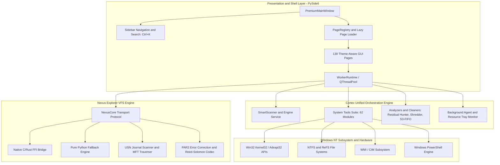

# 🗺️ Repository Architecture Map & Subsystems

This document provides a comprehensive technical overview of the Cortex Workstation & Nexus Explorer architecture for engineers, systems programmers, and open-source contributors.

---

## 1. System Overview & Core Philosophy

Cortex Workstation combines a modern **PySide6 (Qt for Python)** user interface with deep **Win32 Kernel/NTFS subsystems** and a high-performance **Nexus Explorer Virtual File System (VFS)** engine.

### Architectural Principles
1. **Zero Mockery & No Placeholders**: Every tool directly queries real Windows operating system APIs, file systems, or hardware counters.
2. **Non-Destructive by Default**: High-impact actions require explicit user confirmation, provide audit reports, and support rollback where feasible.
3. **Responsive UI Threading**: The Qt main GUI thread never blocks on heavy disk I/O, hash computations, or subprocess invocations. All intensive tasks run through asynchronous worker threads (`WorkerRuntime`).
4. **Resilient Degradation**: If an optional native component is absent, the application gracefully degrades to pure Python equivalents with clear feedback.

---

## 2. High-Level Architecture Flow



---

## 3. The `PageSpec` Contract

Pages are registered declaratively using `PageSpec` dataclasses in `cortex_unified.ui.premium.registry`:

```python
@dataclass(frozen=True, slots=True)
class PageSpec:
    id: str        # Unique identifier used for navigation routing
    title: str     # Display title in the header and search index
    icon: str      # Vector SVG filename from resources/icons/
    group: str     # Parent sidebar navigation group
    factory: str   # Lazy import string "module.path:ClassName"
```

Because `factory` is stored as a string, declaring 139 tools costs under **1 millisecond** at boot time. Modules are only imported when the user navigates to that specific page.
