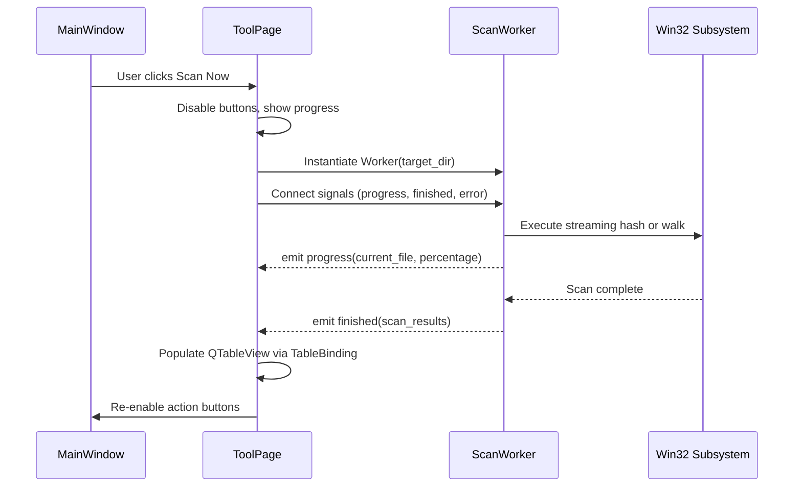

# 🛡️ State Management, Thread Safety & PathGuard

Technical documentation covering Cortex Workstation's concurrency guarantees, asynchronous worker routines, and PathGuard safety boundaries.

---

## 🔒 1. PathGuard Security Boundary

To prevent accidental destruction of system-critical files, all deletion operations in Cortex Workstation pass through the centralized `PathGuard` validator.

### Blacklisted System Paths (Protected from Deletion)
* `C:\Windows` (including `System32`, `SysWOW64`, `WinSxS`)
* `C:\Program Files` & `C:\Program Files (x86)` root paths
* Boot files (`bootmgr`, `bootstat.dat`, `BCD`)
* Active hibernation and swap files (`hiberfil.sys`, `pagefile.sys`, `swapfile.sys`)
* System Volume Information & Recovery partitions

```python
from cortex_unified.ui.safety import PathValidator

validator = PathValidator()
result = validator.validate_deletion(target_path)
if not result.is_safe:
    raise SecurityException(f"Deletion blocked: {result.reason}")
```

---

## 🧵 2. Worker Threading Model (`WorkerRuntime`)

To guarantee a stutter-free 60 FPS user interface, CPU-intensive algorithms and disk I/O routines execute on background worker threads managed by `QThreadPool`.



### Signal Rules
* Workers must never modify Qt widgets directly.
* All UI state updates must be dispatched via Qt `Signal` and `Slot` mechanisms across thread boundaries.
* Workers must poll an `is_cancelled` event token at each iteration to support instant cooperative cancellation.
