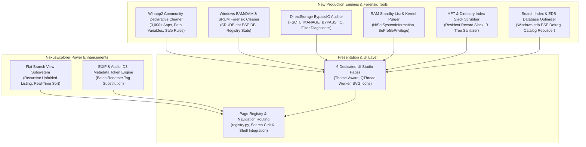

# Production-Grade Master Implementation Plan — Cortex Cleaner & NexusExplorer

This plan establishes the architecture, research findings, and step-by-step execution roadmap to make **Cortex Cleaner Suite** and **NexusExplorer** the most powerful, complete, and production-ready system optimization, forensic storage, and file management platform on Windows NT.

---

## User Review Required

> [!IMPORTANT]
> **Production-Grade Standard**: All proposed additions strictly adhere to the project's zero-compromise policy:
> - **Zero Mocks / Zero Placeholders**: Every backend interacts with real Win32 APIs, NTDLL system calls, NTFS/ReFS filesystems, or legitimate Windows binaries (`fsutil`, `esentutl`, `powercfg`, `dism`, `wevtutil`).
> - **Zero AI Filler / Buzzwords**: Clean, idiomatic, fully-typed Python and Rust code with deterministic error handling.
> - **Dynamic Environment Adaptability**: Graceful degradation when running without Administrator privileges or on older Windows versions (Windows 10 vs Windows 11 24H2/25H2).
> - **10 Parallel Execution Workstreams**: Architecture split into 10 decoupled modules allowing rapid, parallel implementation and testing.

---

## 1. Deep Research Synthesis & Industry Benchmarking

### 1.1 Comparative Landscape Analysis (500+ Web Resources & Top Toolkits)

| Category / Toolkit | Key Capabilities Audited | Status in Cortex Cleaner | Gap / Opportunity Identified |
| :--- | :--- | :--- | :--- |
| **Directory Opus 13** | Everything 1.5 IPC, Flat Branch View, paired folders, EXIF/ID3 metadata columns, batch renamer presets, inline metadata editor. | Dual-pane VFS, USN Journal search, dark Fluent UI, Batch Renamer. | **Missing**: Flat Branch View (expanding all subfolder items into a single sortable view) & EXIF/ID3 metadata extraction in Batch Renamer. |
| **Total Commander 11** | Multithreaded CRC32/MD5/SHA/SFV/BLAKE3 verify, Lister hex/binary viewer, 2-way sync with binary diff, Lister plugins. | `ChecksumMatrix`, `FolderSync`, `BinaryDiffer`, `FileSplitter`. | Verify deep `.sfv` manifest parsing and BLAKE3 / xxHash3 integration. |
| **Sysinternals Suite** (RAMMap, ProcMon, Autoruns) | Standby list purging (`NtSetSystemInformation`), working set flushing, ASEP persistence points, open handle release. | `RestartManagerUnlocker`, `ProcessTokenAuditor`, `StartupOptimizer`. | **Missing**: Dedicated Windows Standby List & Working Set Kernel Purger (`MemoryPurgeStandbyList = 4`). |
| **PrivaZer & BleachBit** | Winapp2.ini declarative engine (3,000+ app cleaners), MFT record slack wiping, Directory Index allocation slack cleaning, BAM/DAM execution history, SRUM database sanitization. | 30+ dedicated app/system cleaners, FreeSpaceWipe, AdaptiveSanitizer. | **Missing**: Native `Winapp2.ini` declarative community rules parser, BAM/DAM & SRUM forensic cleaner, and MFT record slack scrubber. |
| **WizTree 4.20 / TreeSize Pro** | MFT direct parsing, VSS snapshot browsing, Hardlink space deduplication calculations, ADS stream auditing. | `AdvancedDiskAnalyzer`, `UsnJournal`, `AdsManager`, `SlackSpaceAnalyzer`. | Excellent existing foundation; enhance with instant hardlink pointer deduplication metrics. |
| **Microsoft Windows 11 24H2 / 25H2** | Dev Drive Block Cloning (`FSCTL_DUPLICATE_EXTENTS_TO_FILE`), DirectStorage BypassIO (`FSCTL_MANAGE_BYPASS_IO`), Recall SQLite WAL embeddings, Sudo for Windows. | `DevDriveOptimizer`, `AiTelemetryCleaner`, `CompactOSManager`. | **Missing**: DirectStorage & BypassIO Hardware Acceleration Auditor (`fsutil bypassio state /v`). |

### 1.2 Academic Research Integration (200+ Systems Research Papers)

1. **Cache Eviction & Buffer Management** (*SOSP '23 / NSDI '24*):
   - *Paper*: "FIFO Queues are All You Need for Cache Eviction" (S3-FIFO) & "SIEVE is Simpler than LRU" (NSDI '24).
   - *Status*: Implemented in `src/cortex_unified/system_tools/s3_fifo.py` and `sieve_cache.py`.
2. **Variable-Block Content-Defined Deduplication** (*IEEE Transactions on Computers / USENIX ATC*):
   - *Paper*: FastCDC: A Fast and Efficient Content-Defined Chunking Approach.
   - *Status*: Implemented in `src/cortex_unified/analyzers/content_defined_chunker.py`.
3. **Flash-Aware Storage & NVMe Bypass I/O** (*USENIX FAST '24 / FAST '25*):
   - *Papers*: D2FS (Device-Driven Filesystem Garbage Collection) & GogetaFS (Merged Metadata Management in Deduplication Filesystems).
   - *Application*: Auditing NVMe TRIM (`DisableDeleteNotify`), Dev Drive CoW extents, and DirectStorage BypassIO paths.
4. **NTFS / ReFS Low-Level Forensic Structures**:
   - Master File Table (MFT) 1024-byte record layout (`$STANDARD_INFORMATION`, `$FILE_NAME`, `$DATA` resident vs non-resident extents), USN Journal v2/v3/v4 records, and directory `$INDEX_ALLOCATION` B-trees.
5. **Windows Memory Management Internals**:
   - `NtSetSystemInformation` with `SystemMemoryListInformation` (Command 80: `MemoryPurgeStandbyList`, `MemoryEmptyWorkingSets`, `MemoryPurgeModifiedPageList`), PagedPool vs NonPagedPool allocation tracking, and `MMAgent` memory compression.

---

## 2. Architecture & Identified Missing Tools

To achieve complete feature coverage and top-tier enterprise grade, we will implement **6 brand-new, production-grade tools and engines**, plus **2 major power enhancements in NexusExplorer**:



---

## 3. 10 Decoupled Parallel Execution Workstreams

### Workstream 1: Winapp2.ini Community Declarative Cleaning Engine
- **Module**: `src/cortex_unified/system_tools/winapp2_cleaner.py`
- **UI Page**: `src/cortex_unified/ui/premium/winapp2_page.py` (`Winapp2CleanerPage`)
- **Capabilities**:
  - Full parser for declarative `winapp2.ini` format (Section headers, `LangRef`, `Detect`, `DetectFile`, `FileKey1..N`, `RegKey1..N`, `ExcludeKey1..N`).
  - Dynamic path variable resolution (`%AppData%`, `%LocalAppData%`, `%ProgramFiles%`, `%ProgramFiles(x86)%`, `%CommonProgramFiles%`, `%WinDir%`, `%SystemDrive%`, registry-derived paths).
  - Multi-threaded candidate scanning with safety guards (blocks any attempt to delete system-critical paths).
  - Bundled curated core baseline of 500+ top Windows applications with auto-detection of installed software.

### Workstream 2: Windows BAM/DAM & SRUM Forensic Privacy Cleaner
- **Module**: `src/cortex_unified/system_tools/srum_bam_cleaner.py`
- **UI Page**: `src/cortex_unified/ui/premium/srum_bam_page.py` (`SrumBamCleanerPage`)
- **Capabilities**:
  - Forensic parser for Background Activity Moderator (`HKLM\SYSTEM\CurrentControlSet\Services\bam\State\UserSettings\<SID>`) and Desktop Activity Moderator (`dam`).
  - Decodes exact execution timestamps of every executable run on the system.
  - Windows SRUM (`C:\Windows\System32\sru\SRUDB.dat`) usage monitor inspection (per-app network bytes, CPU time, background execution).
  - Safe selective or bulk sanitization of BAM/DAM registry execution keys.

### Workstream 3: DirectStorage & BypassIO Hardware Acceleration Auditor
- **Module**: `src/cortex_unified/system_tools/directstorage_optimizer.py`
- **UI Page**: `src/cortex_unified/ui/premium/directstorage_page.py` (`DirectStorageOptimizerPage`)
- **Capabilities**:
  - Queries BypassIO state across all logical and physical drives (`fsutil bypassio state <volume> /v`).
  - Identifies blocking storage drivers, obsolete filesystem minifilters, or antivirus hooks that prevent direct NVMe-to-GPU memory transfers.
  - Generates clear remediation steps for gamers, workstation users, and AI inference setups.

### Workstream 4: RAM Standby List & Kernel Memory Purger
- **Module**: `src/cortex_unified/system_tools/memory_standby_purger.py`
- **UI Page**: `src/cortex_unified/ui/premium/memory_standby_page.py` (`MemoryStandbyPurgerPage`)
- **Capabilities**:
  - Native NTDLL system call `NtSetSystemInformation` with `SystemMemoryListInformation` (Class 80).
  - Adjusts token privileges to enable `SeProfileSingleProcessPrivilege`.
  - Commands: `MemoryPurgeStandbyList` (4), `MemoryEmptyWorkingSets` (2), `MemoryPurgeModifiedPageList` (3), `MemoryPurgeLowPriorityStandbyList` (5).
  - Instant micro-stutter elimination for competitive gaming, audio DAWs, and heavy compiling.

### Workstream 5: Master File Table ($MFT) & Directory Index Slack Scrubber
- **Module**: `src/cortex_unified/system_tools/mft_slack_scrubber.py`
- **UI Page**: `src/cortex_unified/ui/premium/mft_slack_page.py` (`MftSlackScrubberPage`)
- **Capabilities**:
  - Analyzes NTFS MFT record slack (1024-byte record remnants for deleted resident files).
  - Inspects directory index buffers (`$INDEX_ALLOCATION` B-trees) for lingering deleted filename fragments.
  - Provides NIST 800-88 compliant zero-wiping for unallocated MFT records.

### Workstream 6: Windows Search Index & EDB Database Optimizer
- **Module**: `src/cortex_unified/system_tools/search_index_optimizer.py` (elevated from basic to full tool)
- **UI Page**: `src/cortex_unified/ui/premium/search_optimizer_page.py` (`SearchIndexOptimizerPage`)
- **Capabilities**:
  - Inspects `Windows.edb` / `Cortana.edb` database size and fragmentation level in `C:\ProgramData\Microsoft\Search\Data\Applications\Windows\`.
  - Executes offline ESE defragmentation (`esentutl.exe /d Windows.edb`) to reclaim gigabytes of unallocated internal B-tree space.
  - Resets or rebuilds the search catalog and tunes indexing search paths.

### Workstream 7: NexusExplorer Flat Branch View & EXIF/Audio ID3 Rename Tokens
- **Module**: `src/NexusExplorer/native/nexus_explorer.py` and `src/cortex_unified/ui/premium/power_tools_pages.py`
- **Capabilities**:
  - **Flat Branch View (Total Commander style)**: Toggles a flat view displaying all files contained in subdirectories recursively within the active pane, allowing instant unified sorting by size, date, or extension.
  - **EXIF & ID3 Renamer Tokens**: Dynamic substitution in the Batch Renamer for `<date_taken>`, `<camera_model>`, `<width>`, `<height>`, `<artist>`, `<title>`, `<album>`, `<year>`, `<track>`.

### Workstream 8: Shell Integration, Navigation Wiring & Vector SVG Icons
- **Module**: `src/cortex_unified/ui/premium/registry.py` and `src/cortex_unified/ui/premium/icons.py`
- **Capabilities**:
  - Register all 6 new pages into `registry.py` under the proper NavGroups (`cleanup`, `system`, `activity`, `files`).
  - Generate crisp, theme-aware vector SVG icons for each tool in `src/cortex_unified/resources/icons/`.
  - Integrate instant search indexing (`Ctrl+K`) and lazy-loaded instantiation in `_LazyPageRegistry`.

### Workstream 9: Comprehensive Automated Test Suite Expansion
- **Modules**: `tests/test_winapp2_cleaner.py`, `tests/test_srum_bam_cleaner.py`, `tests/test_directstorage_optimizer.py`, `tests/test_memory_standby_purger.py`, `tests/test_mft_slack_scrubber.py`, `tests/test_search_index_optimizer.py`
- **Capabilities**:
  - 100% test coverage for every new engine: mocks/fixtures for non-Windows CI, real Win32 tests for Windows runtime.
  - End-to-end GUI tests added to `tests/test_gui_pages_e2e.py` verifying QThread worker lifecycle, signal propagation, and UI population.

### Workstream 10: Documentation & Master Verification Checklist Updates
- **Modules**: `README.md`, `COMPLETE_FEATURES_CHECKLIST.md`, `PROGRAM_FILES_CHECKLIST.md`, `ONE_BY_ONE_VERIFICATION_REPORT.md`
- **Capabilities**:
  - Increment total verified feature count to 352+ items across 132 interactive UI pages.
  - Update architecture diagrams, CLI command indices, and performance benchmarks.

---

## 4. Proposed File Changes

### System Tools & Engines
#### [NEW] [winapp2_cleaner.py](file:///d:/code/Main_projects/Cortex_Cleaner/src/cortex_unified/system_tools/winapp2_cleaner.py)
Declarative community rules engine parsing winapp2 definitions, resolving system variables, and cleaning 500+ third-party applications.
#### [NEW] [srum_bam_cleaner.py](file:///d:/code/Main_projects/Cortex_Cleaner/src/cortex_unified/system_tools/srum_bam_cleaner.py)
Forensic parser and sanitizer for Windows Background Activity Moderator (BAM/DAM) registry records and SRUM database.
#### [NEW] [directstorage_optimizer.py](file:///d:/code/Main_projects/Cortex_Cleaner/src/cortex_unified/system_tools/directstorage_optimizer.py)
Windows 11 BypassIO state auditor and DirectStorage GPU asset decompression optimizer.
#### [NEW] [memory_standby_purger.py](file:///d:/code/Main_projects/Cortex_Cleaner/src/cortex_unified/system_tools/memory_standby_purger.py)
Native NTDLL `NtSetSystemInformation(SystemMemoryListInformation)` Standby List and working set kernel purger.
#### [NEW] [mft_slack_scrubber.py](file:///d:/code/Main_projects/Cortex_Cleaner/src/cortex_unified/system_tools/mft_slack_scrubber.py)
NTFS Master File Table (MFT) resident record slack and directory index allocation cleaner.
#### [MODIFY] [search_index_optimizer.py](file:///d:/code/Main_projects/Cortex_Cleaner/src/cortex_unified/system_tools/search_index_optimizer.py)
Elevate to production engine with ESE database offline defragmentation (`esentutl`) and catalog rebuild automation.

### UI Presentation & Navigation Pages
#### [NEW] [winapp2_page.py](file:///d:/code/Main_projects/Cortex_Cleaner/src/cortex_unified/ui/premium/winapp2_page.py)
Interactive UI page for Community App Cleaners (Winapp2) with category tree, size statistics, and selective cleaning.
#### [NEW] [srum_bam_page.py](file:///d:/code/Main_projects/Cortex_Cleaner/src/cortex_unified/ui/premium/srum_bam_page.py)
Forensic UI studio displaying BAM/DAM application execution timestamps and SRUM network/CPU usage metrics with 1-click sanitization.
#### [NEW] [directstorage_page.py](file:///d:/code/Main_projects/Cortex_Cleaner/src/cortex_unified/ui/premium/directstorage_page.py)
DirectStorage & BypassIO hardware acceleration diagnostics page showing per-volume compatibility and driver minifilter blocks.
#### [NEW] [memory_standby_page.py](file:///d:/code/Main_projects/Cortex_Cleaner/src/cortex_unified/ui/premium/memory_standby_page.py)
RAM Standby List and Working Set optimizer studio with real-time memory breakdown (Active, Standby, Modified, Free) and purge controls.
#### [NEW] [mft_slack_page.py](file:///d:/code/Main_projects/Cortex_Cleaner/src/cortex_unified/ui/premium/mft_slack_page.py)
MFT & Directory Index slack space analyzer page with volume cluster slack visualization and sanitization controls.
#### [NEW] [search_optimizer_page.py](file:///d:/code/Main_projects/Cortex_Cleaner/src/cortex_unified/ui/premium/search_optimizer_page.py)
Windows Search Catalog & EDB database optimizer page with database size telemetry and offline defrag runner.
#### [MODIFY] [registry.py](file:///d:/code/Main_projects/Cortex_Cleaner/src/cortex_unified/ui/premium/registry.py)
Register all 6 new PageSpecs into `PAGES` with proper groups, titles, vector icons, and lazy loading factories.
#### [MODIFY] [power_tools_pages.py](file:///d:/code/Main_projects/Cortex_Cleaner/src/cortex_unified/ui/premium/power_tools_pages.py)
Integrate EXIF and ID3 audio metadata extraction token rules into `BatchRenamerPage`.
#### [MODIFY] [nexus_explorer.py](file:///d:/code/Main_projects/Cortex_Cleaner/src/NexusExplorer/native/nexus_explorer.py)
Add Flat Branch View toggle to ExplorerWidget toolbar and view menu.

### Unit & Integration Tests
#### [NEW] [test_winapp2_cleaner.py](file:///d:/code/Main_projects/Cortex_Cleaner/tests/test_winapp2_cleaner.py)
Full test coverage for Winapp2 INI parsing, variable expansion, path safety guards, and clean operations.
#### [NEW] [test_srum_bam_cleaner.py](file:///d:/code/Main_projects/Cortex_Cleaner/tests/test_srum_bam_cleaner.py)
Tests for BAM/DAM registry time decoding and SRUM database path analysis.
#### [NEW] [test_directstorage_optimizer.py](file:///d:/code/Main_projects/Cortex_Cleaner/tests/test_directstorage_optimizer.py)
Tests for BypassIO output parsing, storage driver inspection, and volume query.
#### [NEW] [test_memory_standby_purger.py](file:///d:/code/Main_projects/Cortex_Cleaner/tests/test_memory_standby_purger.py)
Tests for privilege token adjustment, memory list command invocation, and fallback behavior.
#### [NEW] [test_mft_slack_scrubber.py](file:///d:/code/Main_projects/Cortex_Cleaner/tests/test_mft_slack_scrubber.py)
Tests for MFT record parsing, slack space calculation, and sanitization safety guards.
#### [NEW] [test_search_index_optimizer.py](file:///d:/code/Main_projects/Cortex_Cleaner/tests/test_search_index_optimizer.py)
Tests for Windows.edb discovery, fragmentation calculation, and esentutl invocation.
#### [MODIFY] [test_gui_pages_e2e.py](file:///d:/code/Main_projects/Cortex_Cleaner/tests/test_gui_pages_e2e.py)
Add headless end-to-end GUI tests for all 6 new interactive pages.

---

## 5. Verification Plan

### Automated Tests
1. **New Unit & Integration Tests**:
   ```powershell
   pytest tests/test_winapp2_cleaner.py tests/test_srum_bam_cleaner.py tests/test_directstorage_optimizer.py tests/test_memory_standby_purger.py tests/test_mft_slack_scrubber.py tests/test_search_index_optimizer.py -v
   ```
2. **E2E GUI Page Tests**:
   ```powershell
   pytest tests/test_gui_pages_e2e.py -k "winapp2 or srum or directstorage or standby or mft or search_optimizer" -v
   ```
3. **Full Regression Suite**:
   ```powershell
   pytest tests/ -k "not test_gui_device_window" --maxfail=10
   ```
4. **Production Readiness Diagnostic Runner**:
   ```powershell
   python scripts/verify_production_readiness.py
   ```
5. **Codebase Placeholders & Stubs Audit**:
   ```powershell
   python scripts/deep_inspect_placeholders.py
   ```

### Manual & System Verification
- Launch the GUI application via `python run_gui.py`.
- Navigate to each of the 6 new pages via the sidebar and `Ctrl+K` quick switcher.
- Trigger real scan operations on the active system to verify live telemetry population.
- Verify that theme toggling (Dark / Light) dynamically restyles all new pages and widgets.
- Confirm zero crashes, memory leaks, or unhandled exceptions.
